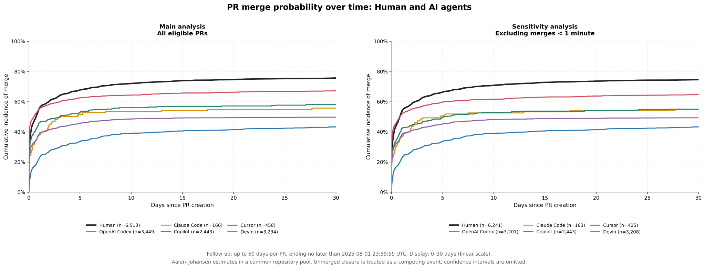
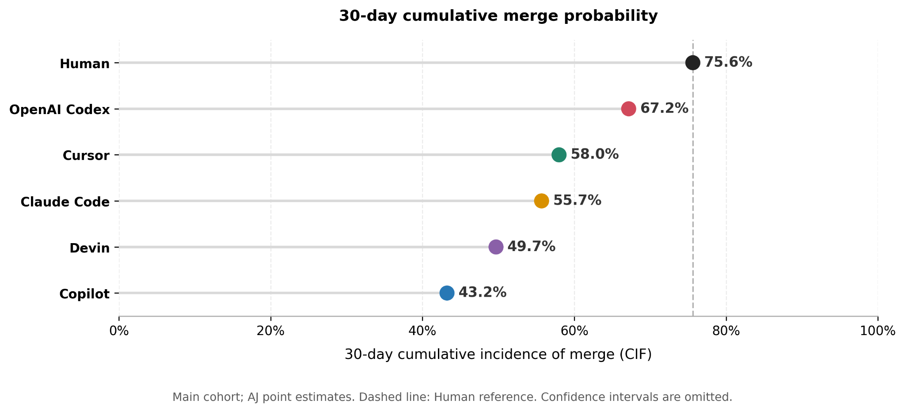

# PR Integration Dynamics in AIDev

A preliminary empirical study of **when pull requests are merged** across human and AI-agent cohorts in the public [AIDev dataset](https://huggingface.co/datasets/hao-li/AIDev). 

Rather than reducing integration to a single merge rate, this project examines how merge outcomes accumulate over time. Merge is treated as the event of interest, closure without merge as a competing event, and unresolved observations as right-censored. Cumulative incidence is estimated with the Aalen–Johansen (AJ) estimator.

The analysis is intended to characterize the selected cohorts and the time structure of PR integration. Repository overlap is used to improve comparability, but the cohorts are not matched or standardized by repository, PR size, task type, calendar period, or other PR-level characteristics.

## Research questions

1. What do the observed cumulative merge probability over time look like across the selected human and agentic PR cohorts?
2. How do these patterns change when merges occurring in less than one minute are excluded?
3. How does competing-risk estimation with Aalen–Johansen differ from treating unmerged closure as censoring with 1 − Kaplan–Meier?

## Integration over time

[](figures/Aalen_Johansen_CIF.png)

The logarithmic axis makes minute- and hour-scale patterns visible alongside longer-term outcomes. Each curve gives the estimated probability of merging **by that time**, accounting for competing unmerged closure.

- **Human and OpenAI Codex form a higher-merging cluster.** The two track closely for the first day; Human PRs pull ahead from around one day onward (75.6% vs. 67.2% at 30 days).
- **Copilot and Devin form a lower cluster** across the full follow-up window.
- **Cursor and Claude Code sit in between and track closely enough that their relative order is not a reliable ranking** — see [Limitations](#limitations-and-next-steps).
- **The pattern is unchanged when merges under one minute are excluded** (sensitivity analysis, right panel).

<details>
<summary>Linear time axis: first 30 days</summary>

[](figures/Aalen_Johansen_CIF_Linear.png)

</details>

## A 30-day snapshot

[](figures/CIF_30d_Dot_Plot.png)

The dashed line marks the Human estimate. Estimates at **1, 3, 7, 30 and 60 days** are in [cif_table.csv](results/cif_table.csv); observed event counts and crude merge proportions — distinct from these censoring-aware CIF estimates — are in [summary_table.csv](results/summary_table.csv).

## Why compare KM and AJ?

[](figures/Methodology_Comparison_ALL_Agents_KM_vs_AJ.png)

AJ estimates cumulative merge probability in the presence of competing unmerged closure. The comparison curve, **1 − KM**, instead treats those closures as censored — a different estimand, not the observed-world merge probability with competing closures present. It yields higher estimates than AJ in every group here.

Shading shows 95% pointwise AJ confidence intervals (not adjusted for repository clustering). Closure percentages in panel titles are observed proportions over each PR's available follow-up, not CIF estimates.

## Study design

| Component          | Definition                                                                                                                    |
| ------------------- | ------------------------------------------------------------------------------------------------------------------------------ |
| Data                | `hao-li/AIDev`, configurations `pull_request` and `human_pull_request`, revision `68ed5f4`                                     |
| Cohort              | Repositories present in both source configurations; PRs deduplicated by `html_url`, retaining the agent label when duplicated  |
| Main sample         | 16,263 PRs: Human 6,513; OpenAI Codex 3,449; Claude Code 166; Copilot 2,443; Cursor 458; Devin 3,234                           |
| Time origin         | PR creation                                                                                                                    |
| Event of interest   | Merge within available follow-up                                                                                              |
| Competing event     | Closure within follow-up for PRs without a recorded merge; modeled as terminal                                                 |
| Censoring           | No qualifying event before the earlier of 60 days after creation and `2025-08-01 23:59:59 UTC`                                 |
| Sensitivity cohort  | Exclude PRs merged in less than 60 seconds; retain other eligible PRs                                                          |

A common repository pool does not imply matched PRs or equal repository weights across agents.

## Run the notebook

```bash
git clone https://github.com/ra1nowzz/Human_vs_Agentic_PR_Integration_Dynamics.git
cd Human_vs_Agentic_PR_Integration_Dynamics
pip install -r requirements.txt
jupyter notebook analysis.ipynb
```

Run the cells in order from the repository root. The notebook downloads the fixed dataset revision, constructs the cohorts, fits the estimators, and writes four figures and two CSV tables. Internet access is needed for the initial dataset download.

| Path                                                     | Contents                                                            |
| --------------------------------------------------------- | --------------------------------------------------------------------- |
| [analysis.ipynb](analysis.ipynb)         | Complete analysis and plotting code                                 |
| [requirements.txt](requirements.txt)     | Python dependencies                                                  |
| [figures/](figures)                      | Logarithmic and linear CIF views, 30-day summary, KM–AJ comparison   |
| [results/](results)                      | Event counts and fixed-time CIF estimates                            |

## Limitations and next steps

**What the gaps do and don't support:** The large gap separating {Human, OpenAI Codex} from {Copilot, Devin} — roughly 20-30 points, present in both the main and sensitivity cohorts and under both estimators — is unlikely to be a sample-size artifact given the cohort sizes involved (all four groups exceed 2,400 PRs). The closer ordering among Cursor (n=458), Claude Code (n=166), and Devin is far more sensitive to sample size and repository mix, and should not be read as a reliable ranking. Neither pattern indicates *why* groups differ.

- **Comparability:** Task type, PR size, calendar period, contributor experience, and repository policies are not controlled. Agent selection and usage patterns may also differ.
- **Uncertainty:** Confidence intervals do not account for correlation among PRs in the same repository, and censoring-aware estimation still relies on the censoring assumptions stated above.
- **Event history:** Closure is modeled as terminal using snapshot timestamps; reopening and repeated review–revision cycles are not reconstructed.
- **Scope:** Merge probability measures one aspect of integration. It does not establish code quality, review burden, developer productivity, or causal effects of agent use.

Planned extensions: examine repository- and PR-level comparability more directly, add uncertainty estimates that account for repository clustering, and — subject to comparable Human and agent timeline data — study where differences emerge around first human response and subsequent revision. These extensions are not implemented in this notebook.

## References and license

- [The Rise of AI Teammates in Software Engineering (SE) 3.0](https://arxiv.org/abs/2507.15003) — source study introducing AIDev.
- [On the Use of Agentic Coding: An Empirical Study of Pull Requests on GitHub](https://arxiv.org/abs/2509.14745) — related empirical study motivating interest in PR integration and incomplete observations.
- [AalenJohansenFitter documentation](https://lifelines.readthedocs.io/en/latest/fitters/univariate/AalenJohansenFitter.html) — estimator implementation used here.

Code is available under the [MIT License](LICENSE). The source data remain subject to the terms and attribution requirements on the [AIDev dataset page](https://huggingface.co/datasets/hao-li/AIDev).
