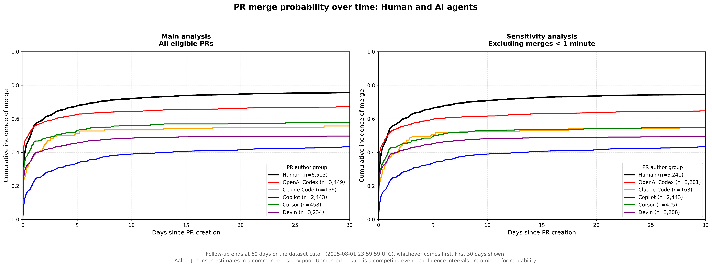
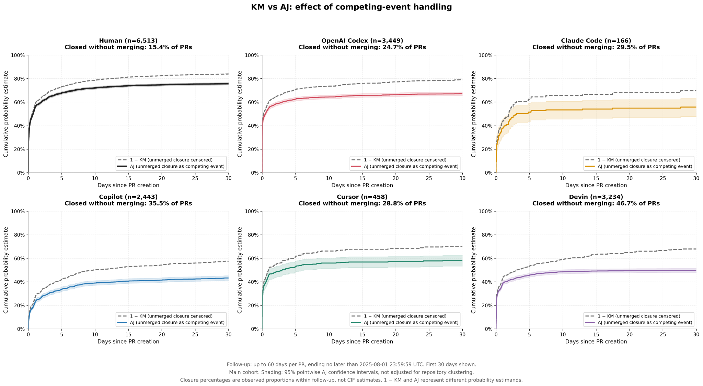

# Human vs Agentic PR Integration Dynamics

A competing-risks analysis of pull-request merge dynamics comparing human developers and AI coding agents (OpenAI Codex, Claude Code, GitHub Copilot, Cursor, and Devin). Using the public [AIDev](https://huggingface.co/datasets/hao-li/AIDev) dataset, this project explicitly accounts for **unmerged closure as a competing event** and **right censoring**.

---

## Research Questions

This exploratory analysis asks:

1. How does the cumulative incidence of PR merge differ between human-authored and agentic PRs?
2. Are the observed patterns sensitive to extremely fast merges?
3. How does treating unmerged closure as a competing event affect estimated merge probabilities?

---

## Main Results



Within the repository-aligned cohort, the Aalen–Johansen estimator yields the following cumulative incidence of PR merge:

<div align="center">

| Author group     | PRs   | 7-day CIF | 30-day CIF | 60-day CIF |
| ----------------- | ----- | --------- | ---------- | ---------- |
| **Human**        | 6,513 | 70.2%     | 75.6%      | 76.7%      |
| **OpenAI Codex** | 3,449 | 63.5%     | 67.2%      | 67.8%      |
| **Cursor**       | 458   | 54.8%     | 58.0%      | 58.0%      |
| **Claude Code**  | 166   | 52.7%     | 55.7%      | 55.7%      |
| **Devin**        | 3,234 | 47.3%     | 49.7%      | 50.1%      |
| **Copilot**      | 2,443 | 36.5%     | 43.2%      | 44.8%      |

</div>

- **Key Observation:** Human-authored PRs show the highest cumulative incidence of merge, followed by OpenAI Codex.
- **Sensitivity Analysis:** Excluding merges occurring less than one minute after PR creation produces a broadly similar pattern, suggesting that the main result is not driven solely by extremely fast merges.
- **Interpretation:** These comparisons are descriptive and should not be interpreted as causal estimates of agent quality or capability.

---

## Method

- **Cohort:** Human and agentic PRs are restricted to repositories appearing in both datasets to improve comparability.
- **Outcomes:** Merge is the event of interest. Assuming unmerged closure as a terminal outcome (i.e., without modeling the potential for a PR to be reopened), it is treated as a competing event rather than ordinary censoring. Unresolved PRs are right-censored.
- **Follow-up:** PRs are observed up to 60 days after creation or until the dataset cutoff, whichever is earlier.
- **Estimator:** The cumulative incidence of merge is estimated using the **Aalen–Johansen estimator**.
- **Methodological Comparison:** As a methodological comparison, we compare Aalen–Johansen estimates with 1 − Kaplan–Meier, where unmerged closure is treated as censoring, to illustrate how competing-event handling changes the estimated merge probability.

---

#### Why Competing Risks Matter

Under our modeling assumptions, unmerged closure acts as a terminal state that precludes a subsequent merge, thereby constituting a competing event rather than ordinary censoring.



Treating unmerged closure as censoring yields systematically higher 1 − KM estimates than the Aalen–Johansen CIF. The two approaches correspond to different probability estimands; AJ directly estimates the cumulative incidence of merge in the presence of competing unmerged closure.

---

## Data & Reproduction

The analysis uses the public **AIDev** dataset:

- **Dataset:** `hao-li/AIDev`
- **Configurations:** `pull_request`, `human_pull_request`
- **Fixed revision:** `68ed5f4`
- **Dataset cutoff:** `2025-08-01 23:59:59 UTC`

Python 3.10+ is recommended.

### 1. Install dependencies

```bash
pip install -r requirements.txt
```

### 2. Run the analysis

```bash
jupyter notebook analysis.ipynb
```

Running all cells will:

1. Automatically fetch the fixed AIDev dataset revision (`68ed5f4`) from Hugging Face.
2. Execute the competing-risks analysis and sensitivity checks.
3. Save generated plots to `figures/`.
4. Export summary tables to `results/`.

Both directories are created automatically on first run if they do not already exist, so a fresh clone reproduces the full structure above.

---

## Repository Structure

```
.
├── analysis.ipynb     # End-to-end pipeline: load data -> competing-risk model -> figures -> tables
├── requirements.txt   # Python dependencies
├── figures/           # Generated plots (created automatically by analysis.ipynb)
├── results/           # Generated summary tables (created automatically by analysis.ipynb)
├── .gitignore
└── README.md
```

---

## Limitations

This analysis is exploratory and observational. Key limitations include:

- **Unmeasured Confounders:** While repository alignment restricts comparisons to shared codebases, it does not control for PR-level covariates such as task complexity, lines of code (churn), contributor seniority, or project-specific merge policies.
- **Sample Size Disparity:** Sample sizes differ substantially across agent cohorts (e.g., >3,000 PRs for Devin vs. 166 PRs for Claude Code), leading to varying statistical precision.
- **Pointwise Variance:** Confidence bands shown in the methodological comparison represent pointwise estimates and do not account for clustering/correlation of PRs within identical repositories.
- **Tool Selection Bias:** Agent usage and trigger mechanisms differ fundamentally across tools (e.g., autonomous issue solvers vs. interactive IDE assistants), introducing selection effects in PR submission.
- **Non-Causal Interpretation:** Findings reflect observed survival/merge dynamics in real-world repositories and must **not** be interpreted as causal benchmarks of agent capabilities.

---

## Status

This repository contains preliminary empirical research conducted as part of an ongoing exploration into empirical software engineering and AI-assisted software development.

---

## References

[1] H. Li, H. Zhang, and A. E. Hassan, "The Rise of AI Teammates in Software Engineering (SE) 3.0: How Autonomous Coding Agents Are Reshaping Software Engineering," *arXiv preprint arXiv:2507.15003*, 2025. (Dataset `hao-li/AIDev`)

[2] M. Watanabe, H. Li, Y. Kashiwa, B. Reid, H. Iida, and A. E. Hassan, "On the Use of Agentic Coding: An Empirical Study of Pull Requests on GitHub," *ACM Transactions on Software Engineering and Methodology (TOSEM)*, 2026.

---

## License & Acknowledgements

* **Code**: The analytical code in this repository is open-sourced under the [MIT License](LICENSE). 
* **Data**: This project utilizes the [AIDev dataset](https://huggingface.co/datasets/hao-li/AIDev), which is distributed under the [Creative Commons Attribution 4.0 International (CC BY 4.0) License](https://creativecommons.org/licenses/by/4.0/) by Hao Li, Haoxiang Zhang, and Ahmed E. Hassan.
